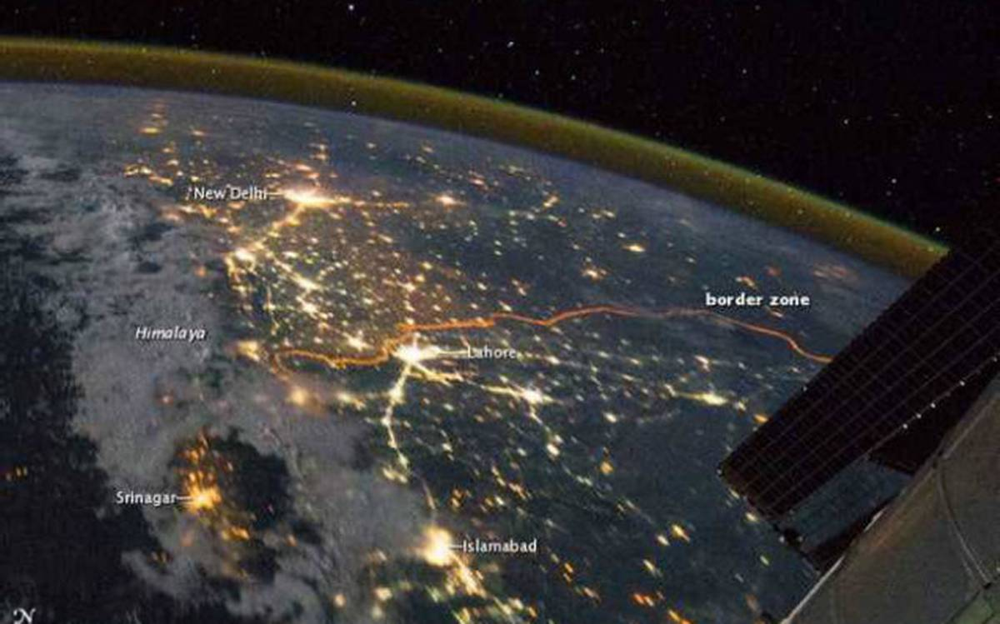
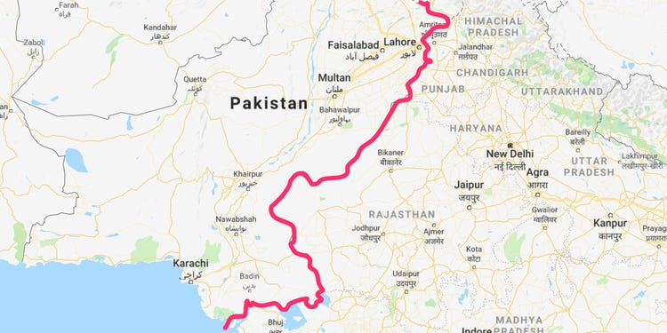

# border-data-by-student-

We are trying to do new things with the Data

India is erecting a new non-cut 'steel fence' to plug vulnerable and infiltration-prone patches along its
sensitive border with Pakistan. They said the single-row fence, with loops of concertina wires on top, is
being erected at a 60-km border stretch in near Amritsar in Punjab. This fence will cost about Rs 2 crore
for a kilometre, official sources said.

Based on the feedback of these projects, new fence will be erected at more places where either the old one
has worn out or there was no fence owing to geographical challenges.
The sources informed that the Union home ministry has also advanced a technology-based project of deploying
'laser fences' along these two borders, to five years as compared to the earlier 10-year deadline.
The Comprehensive Integrated Border Management System (CIBMS) that entails deployment of smart fences, 
advanced surveillance gadgets and anti-infiltration alarms has been speeded up by the border management
division under the Ministry of Home Affairs (MHA) and Border Security Force along these two borders.

<html>

<head>
 
<h1>
red blood border
 </h1>
 
</head>

<body>
 

<h1>why well secure border is important	with advance equipment </h1>

 If you grew up in northern India, a visit to Pakistan is always a somewhat surreal experience. It’s like passing through a looking glass to a place that manages to feel both foreign and deeply familiar at the same time. But reality is totally different. The heightened tensions stemmed from a suicide car bombing carried out on <b> 14 February 2019 </b> in which 40 Indian security personnel were killed. A Pakistan-based militant group, <b> Jaish-e-Mohammad,</b> claimed responsibility for the attack.India blamed Pakistan for the bombing and promised a robust response.India has regularly stated Pakistan was utilising militants to destabilise India. Pakistan, however, took no action against the terrorist group. Their economy is funded by those terror groups. We all know where osama bin laden found out right. There policy are made in favor of any terrorist so terror group consider pakistan as their second home. 
the Line of Control demarcates the areas of administration: Pakistan administers the territory to the northwest of the line; India administers the territory to the southeast. Since 1989, a militant-fueled insurgency has raged in Indian-administered Kashmir, driven by a desire for islamic kingdom with Pakistan. The United Nations has stated Pakistan was providing material support to the militants. 
 

<h1> India building new 'steel fence' along Pakistan</h1>

 
 India is erecting a new non-cut 'steel fence' to plug vulnerable and infiltration-prone patches along its sensitive border with Pakistan. They said the single-row fence, with loops of concertina wires on top, is being erected at a 60-km border stretch in near Amritsar in Punjab. This fence will cost about Rs 2 crore for a kilometre, official sources said.  
 
Based on the feedback of these projects, new fence will be erected at more places where either the old one has worn out or there was no fence owing to geographical challenges.  

The sources informed that the Union home ministry has also advanced a technology-based project of deploying 'laser fences' along these two borders, to five years as compared to the earlier 10-year deadline.  
The Comprehensive Integrated Border Management System (CIBMS) that entails deployment of smart fences, advanced surveillance gadgets and anti-infiltration alarms has been speeded up by the border management division under the Ministry of Home Affairs (MHA) and Border Security Force along these two borders. 
  

 
<h1> Line of control </h1>
Sources said that while infiltration bases and terror launch pads along the International Border (IB) in Jammu and Line of Control (LoC) in Kashmir are still intact, the latest concern of the security agencies are the well-trained terrorists from Afghanistan whose presence along the vulnerable infiltration spots along Pakistan border can be used to foment trouble in the newly-created Union Territory (UT) of Jammu-Kashmir and other locations in the hinterland.    
The BSF, they said, has also recently completed and exercise to fully "map and identify" vulnerable spots all along these two borders as part of a three-staged exercise carried out last year.    

There is lot of work that is happening to secure the borders along Pakistan and Bangladesh, they said. 

Latest measures include strengthening Indian defences along Pakistan, mapping of infiltration prone areas along the two borders, and erection of new steel fence along vulnerable patches.  

</body>{"type":"FeatureCollection","features":[{"type":"Feature","properties":{},"geometry":{"type":"Point","coordinates":[74.0287971496582,34.088776986675654]}},{"type":"Feature","properties":{},"geometry":{"type":"Point","coordinates":[73.4831714630127,34.35137289731883]}},{"type":"Feature","properties":{},"geometry":{"type":"Point","coordinates":[73.48076820373535,34.35916726571363]}},{"type":"Feature","properties":{},"geometry":{"type":"Point","coordinates":[73.47201347351074,34.367244300826066]}},{"type":"Feature","properties":{},"geometry":{"type":"Point","coordinates":[73.46686363220215,34.368165316778736]}},{"type":"Feature","properties":{},"geometry":{"type":"Point","coordinates":[73.50029468536377,34.3390952974365]}},{"type":"Feature","properties":{},"geometry":{"type":"Point","coordinates":[73.49877119064331,34.33875865682487]}},{"type":"Feature","properties":{},"geometry":{"type":"Point","coordinates":[73.486647605896,34.343081728248166]}},{"type":"Feature","properties":{},"geometry":{"type":"Point","coordinates":[73.46832275390624,34.35186892417437]}},{"type":"Feature","properties":{},"geometry":{"type":"Point","coordinates":[73.46488952636719,34.34733371224279]}},{"type":"Feature","properties":{},"geometry":{"type":"Point","coordinates":[73.4672498703003,34.33202556084483]}},{"type":"Feature","properties":{},"geometry":{"type":"Point","coordinates":[73.47214221954346,34.33727033477086]}},{"type":"Feature","properties":{},"geometry":{"type":"Point","coordinates":[73.47673416137695,34.31891219145166]}},{"type":"Feature","properties":{},"geometry":{"type":"Polygon","coordinates":[[[73.480167388916,34.31253197351638],[73.48703384399414,34.31253197351638],[73.48703384399414,34.31848685867645],[73.480167388916,34.31848685867645],[73.480167388916,34.31253197351638]]]}},{"type":"Feature","properties":{},"geometry":{"type":"Polygon","coordinates":[[[73.50261211395264,34.34573924351225],[73.50535869598389,34.34573924351225],[73.50535869598389,34.34772346665394],[73.50261211395264,34.34772346665394],[73.50261211395264,34.34573924351225]]]}},{"type":"Feature","properties":{},"geometry":{"type":"Point","coordinates":[73.46377372741699,34.38116473098721]}},{"type":"Feature","properties":{},"geometry":{"type":"Point","coordinates":[73.46308708190917,34.38580436023252]}},{"type":"Feature","properties":{},"geometry":{"type":"Polygon","coordinates":[[[73.46909523010254,34.37220349796861],[73.47244262695312,34.37220349796861],[73.47244262695312,34.37535597779806],[73.46909523010254,34.37535597779806],[73.46909523010254,34.37220349796861]]]}},{"type":"Feature","properties":{},"geometry":{"type":"Point","coordinates":[74.58961486816406,32.54652376838932]}},{"type":"Feature","properties":{},"geometry":{"type":"Point","coordinates":[74.62188720703125,32.531762869982266]}},{"type":"Feature","properties":{},"geometry":{"type":"Point","coordinates":[74.62326049804688,32.479356572655625]}},{"type":"Feature","properties":{},"geometry":{"type":"Point","coordinates":[74.59957122802734,32.46197758027953]}},{"type":"Feature","properties":{},"geometry":{"type":"Point","coordinates":[74.57897186279297,32.433005140150016]}},{"type":"Feature","properties":{},"geometry":{"type":"Point","coordinates":[74.55390930175781,32.56099288173127]}},{"type":"Feature","properties":{},"geometry":{"type":"Point","coordinates":[74.51717376708984,32.45125886305044]}},{"type":"Feature","properties":{},"geometry":{"type":"Point","coordinates":[74.48181152343749,32.46921923476023]}},{"type":"Feature","properties":{},"geometry":{"type":"Point","coordinates":[74.42996978759766,32.47732919639942]}},{"type":"Feature","properties":{},"geometry":{"type":"Polygon","coordinates":[[[74.60712432861327,32.420254316120676],[74.63012695312499,32.420254316120676],[74.63012695312499,32.43966962613718],[74.60712432861327,32.43966962613718],[74.60712432861327,32.420254316120676]]]}},{"type":"Feature","properties":{},"geometry":{"type":"Polygon","coordinates":[[[74.57931518554688,32.57169852370653],[74.60678100585936,32.57169852370653],[74.60678100585936,32.59137042547153],[74.57931518554688,32.59137042547153],[74.57931518554688,32.57169852370653]]]}},{"type":"Feature","properties":{},"geometry":{"type":"Point","coordinates":[74.43855285644531,32.53697287588033]}},{"type":"Feature","properties":{},"geometry":{"type":"Point","coordinates":[74.37538146972656,32.53465735501395]}},{"type":"Feature","properties":{},"geometry":{"type":"Point","coordinates":[74.49417114257812,32.59831241897488]}},{"type":"Feature","properties":{},"geometry":{"type":"Polygon","coordinates":[[[74.51065063476562,32.42981760314475],[74.5147705078125,32.42981760314475],[74.5147705078125,32.42981760314475],[74.51065063476562,32.42981760314475],[74.51065063476562,32.42981760314475]]]}},{"type":"Feature","properties":{},"geometry":{"type":"Polygon","coordinates":[[[74.51683044433594,32.43619256447739],[74.51683044433594,32.43966962613718],[74.51683044433594,32.43966962613718],[74.51683044433594,32.43619256447739]]]}},{"type":"Feature","properties":{},"geometry":{"type":"Polygon","coordinates":[[[74.51099395751953,32.42764421785885],[74.52301025390625,32.42764421785885],[74.52301025390625,32.438003550826124],[74.51099395751953,32.438003550826124],[74.51099395751953,32.42764421785885]]]}}]}
</html>
